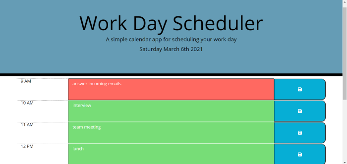

# [DayScheduler](https://chopsushi206.github.io/DayScheduler/)

## Acceptance Criteria

```
GIVEN I am using a daily planner to create a schedule
WHEN I open the planner
THEN the current day is displayed at the top of the calendar
WHEN I scroll down
THEN I am presented with timeblocks for standard business hours
WHEN I view the timeblocks for that day
THEN each timeblock is color coded to indicate whether it is in the past, present, or future
WHEN I click into a timeblock
THEN I can enter an event
WHEN I click the save button for that timeblock
THEN the text for that event is saved in local storage
WHEN I refresh the page
THEN the saved events persist
```

## Development

Was given pre-existing code for this assignment. Began by creating a repo and uploading existing documents within proper directories. 
At first was taking the approach to render all the code for the schedule hour blocks , input and buttons to bbe rendered within the script.js.

Considering there are only 9 slots of time given, thought it would make it much simpler to render these within the HTML document provided. Created a "row" structure with a div, that contained the elements for the timeblock, text input area, and save button.

CSS styles were added to these elements, using the css stylsheet that had already been created. Also used some bootstrap classes to define the layout span on the page. Ideally would have liked to create a different layout if the user was viewing on a smaller display, but would have had to redefine some of the css classes given, so felt it was simpler to keep it as is.

Then a script.js file was started and was first able to define a variable using moment().format() to display the current Date beneath the header on the index.html page. 

After I began work on a .each loop, that loops through each div with the class 'row' and assign appropriate css classes, that allows the background color to change based on whether the hours are the current hour, past time, or future time.

Once that was working without error a click function was created and applied to any button with the class of "saveBtn". The function being to set 'this' buttons sibling and parent content into local storage. 

These local storage items were then called back in the previous for loop by adding a variable named value set to equal the localstorage content for each "hour". 

Using 'this' the variable value was then put into the value of the text area, so that when the page is refreshed, if an item had been saved in local storage, it would display. 

Added comments to javascript, completing the assignment.


## Screenshots



---

## Developer


 Coding and repository done by [Li Hua Anderson](https://github.com/chopsushi206).

[Email](mailto:lihua.anderson@gmail.com) | [LinkedIn](https://linkedin.com/in/li-hua-anderson-b259b7144)
